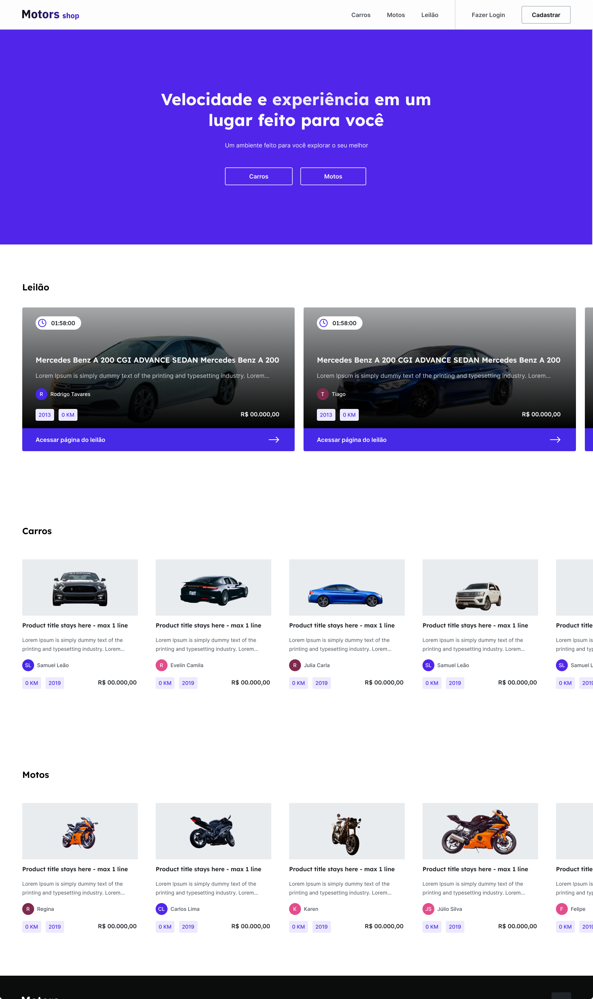

# Motors Shop

## Projeto Final do Modulo 6 - Kenzie Academy Brasil

- O projeto final do curso de desenvolvimento web da Kenzie Academy Brasil consiste em uma aplicação full stack de um E-commerce de veiculos.

## Front-End

## [FIGMA](https://www.figma.com/file/gEUjTK4ozBPNbJnqI8qZPH/M6---E-Commerce?node-id=46%3A3&t=dyFMg6cLzCzVz5lz-0)

## Tecnologias e ferramentas utilizadas

- React.js
- javascript/typescript
- vite

## Iniciando a aplicação

- Por se tratar de um project react.js é necessario ter o node.js e o yarn instalados no ambiente de desenvolvimento, e seguir os passos abaixo:

1. Clonar o repositorio localmente
2. Dentro do diretorio ./front-end executar os camandos abaixo
   - `yarn` ou `yarn install`
   - `yarn dev`

# Observações de desenvolvimento

## Idioma do codigo

- Inglês

### Componentes e Funções:

- São declarados em variaveis
  `const Nome () => {
    return 
}`

### Styled-Components

- O styled (css) deve adotar o modelo de nome ComponentStyled.
  Caso o styled-Component seja mais complexo o modelo de nome deve segui o mesmo padrão mas sendo a descrição da função do elemento ex:
  Card, DropMenu, Modal, HeaderModal, FormLogin, FormRegister

## Conventional Branchs/Commits

### Branchs

##### Master:

    Branch padrão do repositório, só aceitará pull request da branch
    Develop ou de uma branch hotFix

##### Develop:

    Branch de desenvolvimento, todas as branchs de feature serão criadas apartir desta.

##### Feature:

    Branch usada para desenvolver uma nova funcionalidade. Essa
    branch só existem enquanto a funcionalidade está sendo
    desenvolvida, mas será excluida quando o merge for realizado
    para branch develop

##### HotFix:

    Branch para correções emergenciais da branch Master caso esta já
    esteja em produção nesse caso a branch Develop também deve ser
    atualizada, ou para correções emergenciais da branch Develop
    antes que está seja mergeada com a Master

#### Modelo de Branch

    tipoDaBranch_nomeDafuncionalidade (escrito em ingles com camelCase)

### Commits

    Os arquivos deverão ser adicionados individualmente para serem
    commitados evitando o uso de git add .

##### feat:

     Commits, que adicionam um novo recurso

##### fix:

     Commits, que corrige um bug

##### refactor:

    Commits, que reescrevem/reestruturam seu código, porém
    não alteram nenhum comportamento

##### perf:

    são commits de refatoração especiais, que melhoram o desempenho

##### style:

    Commits, que não afetam o significado (espaço em branco,
    formatação, ponto e vírgula ausente etc.)

##### docs:

    Commits, que afetam apenas a documentação

##### build:

    Commits, que afetam componentes de compilação como ferramenta de
    compilação, pipeline ci, dependências, versão do projeto ...

##### chore:

    Commits, Utilizado na atualização para mudanças em
    ferramentas, configurações e bibliotecas. Atualizações que não ocasionam alteração no código de produção.

## EQUIPE

- Marcelo Cabral Romão - (Instrutor e PO do Projeto)
- Daniel Carvalho - (Aluno e DEV do projeto)
- Raimundo Neto - (Aluno e DEV do projeto)
- Roberto Fernandes - (Aluno e DEV do projeto)
- Victor Gois - (Aluno e DEV do projeto)
